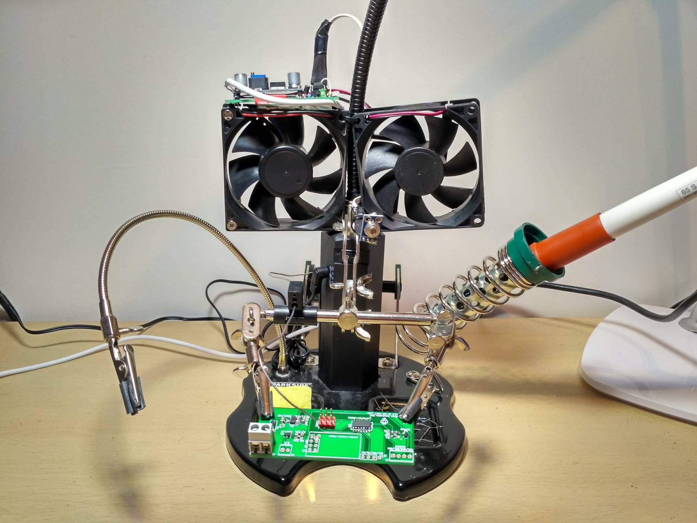

# Automatic-Fume-Extractor
Automatic fume extractor for a soldering station

MLX90614 sensor measures temperature. 
If object temperature is 10 degrees higher than ambiente temperature, the fan and led are activated.
When temperature difference is less than 10 degrees,the fan stops after 10 seconds. During this delay the led is blinking.

**Bill of material:**

	- Attiny85
	- MLX90614 module
	- XL6009 DC-DC module
	- 12V PC fan
	- 1N4148
	- BS170
	- 10K resistor
	- 330 resistor
	- green Led

**PICTURES:**

**SCHEMATIC:**

Schematic.pdf

https://github.com/JaviElio/Automatic-Fume-Extractor/blob/master/Schematic.pdf

